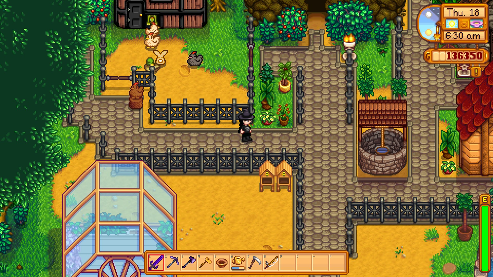
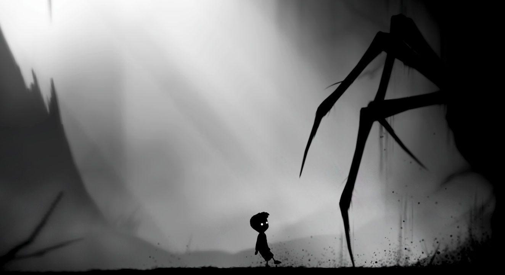
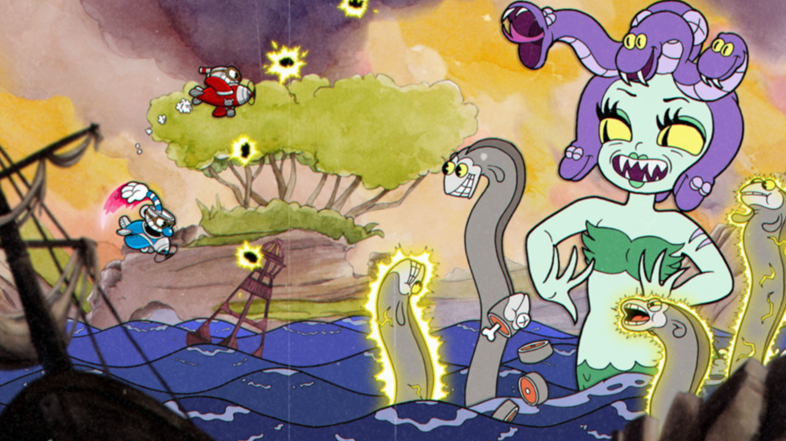
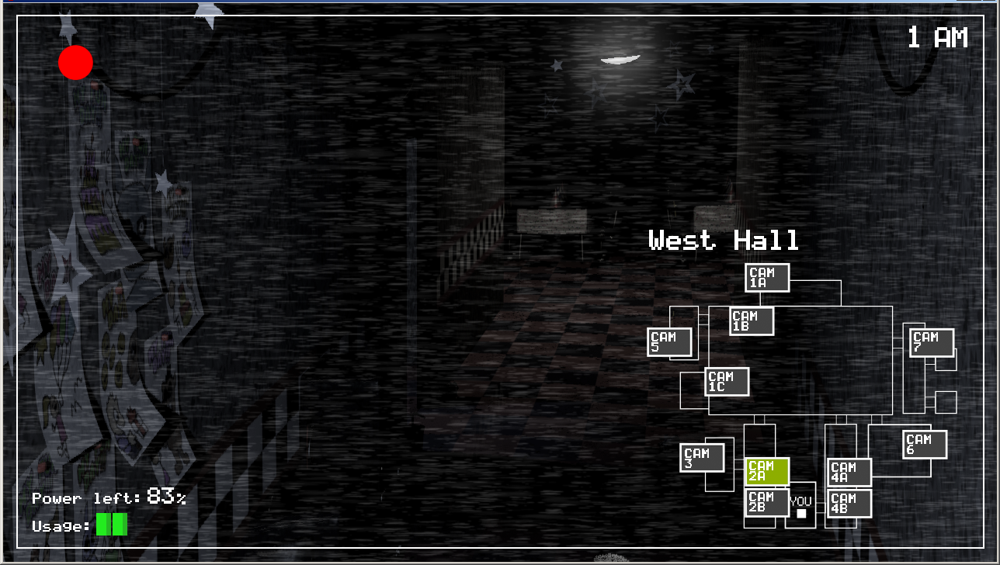
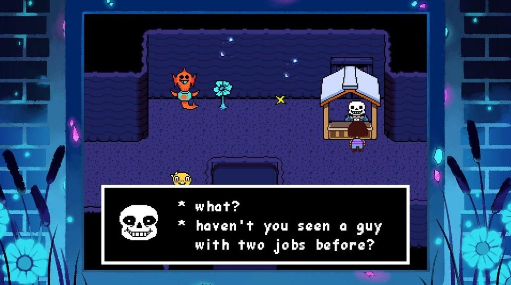
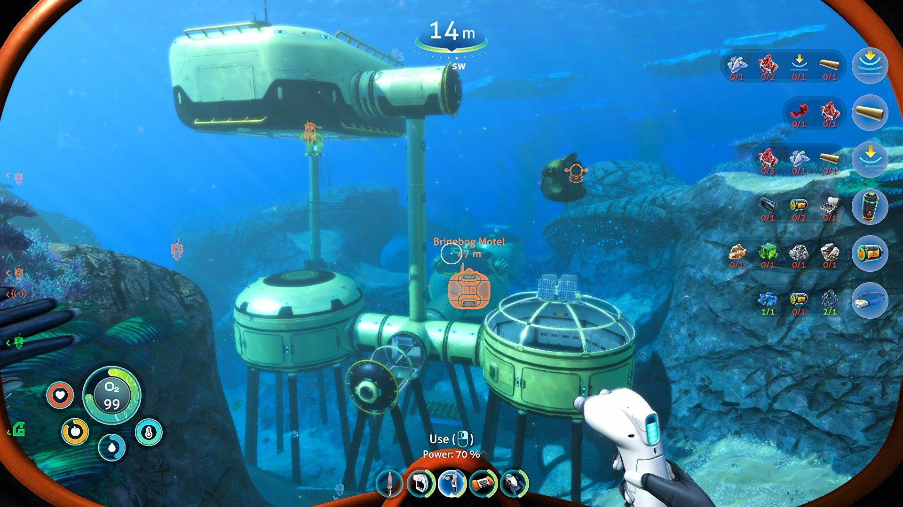
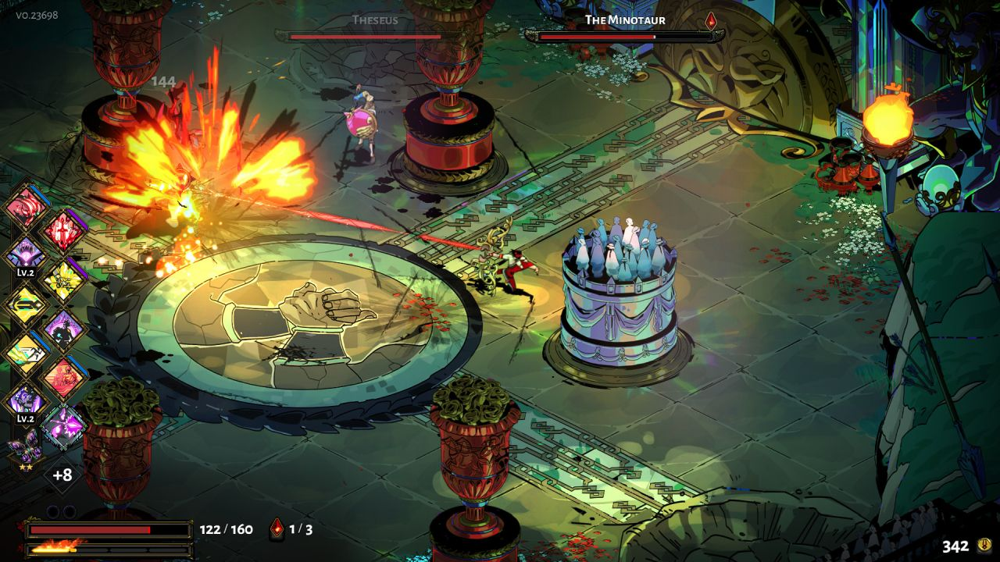
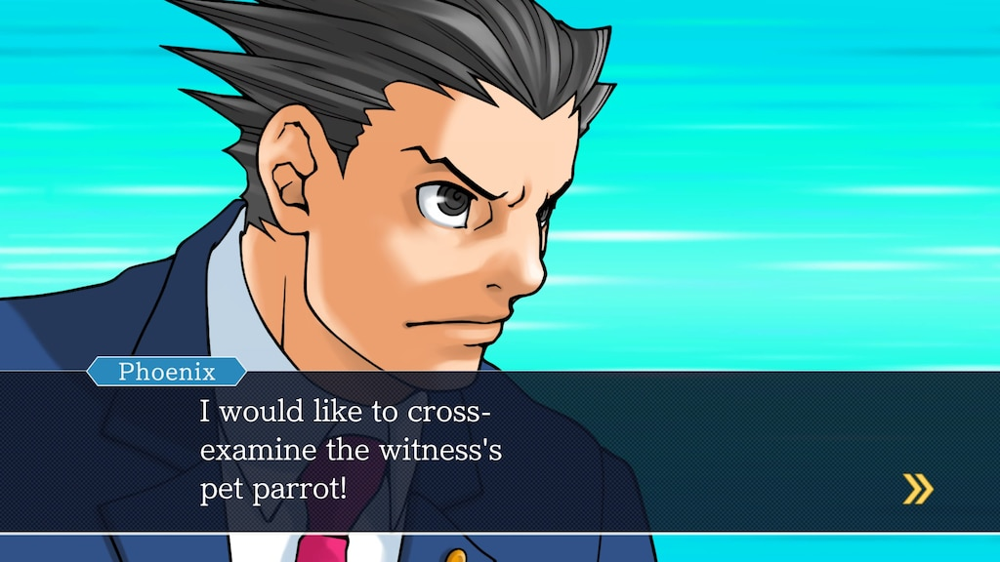
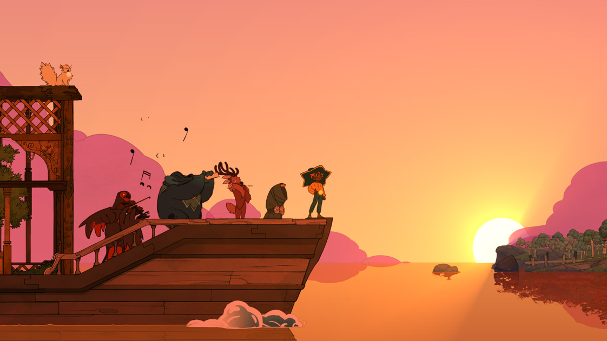

# ***10 Wspaniałych gier***

Niesamowite gry, które spodobały się graczom z całego świata.  
Od pięknych gier, których główną zaletą jest fabuła, do trudniejszych, bardziej wymagających.  
Niektóre skradają serca grafiką, a inne humorem czy rozgrywką. Każdy znajdzie coś dla siebie. 

### ***Lista gier:***
[10.Stardew valley](https://kknopik.github.io/#10stardew-valley)  
[9.Limbo](https://kknopik.github.io/#9limbo)  
[8.Cuphead](https://kknopik.github.io/#8cuphead)  
[7.Seria Five night's at Freddy's](https://kknopik.github.io/#7seria-gier-five-nights-at-freddys)  
[6.Undertale](https://kknopik.github.io/#6undertale)  
[5.Subnautica: Below Zero](https://kknopik.github.io/#5subnautica-below-zero)  
[4.Hades](https://kknopik.github.io/#4hades)  
[3.Seria Ace Attorney](https://kknopik.github.io/#3seria-gier-ace-attorney)  
[2.Spiritfarer](https://kknopik.github.io/#2spiritfarer)  
[1.Night in the woods](https://kknopik.github.io/#1night-in-the-woods)  

### ***10.Stardew valley***

Stardew valley to symulator rolnictwa. Jest to bardzo przyjemna i relaksująca gra. Ma świetną ścieżkę dźwiękową i prostą grafikę. Zadaniem gracza jest uprawianie roślin, karmienie zwierząt, ogólnie robienie wszystkiego, co robi się na zwykłej farmie. Gra może wydawać się nudna, jednak ma wiele ciekawych wątków i fajną mechanikę gry. Jest dobrze znana z minigry wędkarskiej. Nie chcę pisać za dużo, bo to psuje przyjemność z odkrywania gry na własną rękę.    
*Link do gry na [Steam](https://store.steampowered.com/app/413150/Stardew_Valley/).*

### ***9.Limbo***

Limbo to bardzo atmosferyczna logiczna-platformówka. Niesamowita, mroczna, ale prosta grafika, brak dialogów, jakiegokolwiek tekstu i dziwne dźwięki sprawiają, że gra jest jedyna w swoim rodzaju. Opowiada historię w wyjątkowy sposób, pozostawiając wszystko do interpretacji graczowi. Od początku do końca, gra nigdy nie przestaje zadziwiać, zachwycać i przerażać gracza.  
*Link do gry na [Steam](https://store.steampowered.com/app/48000/LIMBO/?l=polish).*

### ***8.Cuphead***

Cuphead to wymagająca gra platformowa, w której walczysz z różnymi wrogami, aby uzyskać ich kontrakty duszy. Gra jest stylizowana, aby wyglądać i brzmieć jak stara kreskówka, co czyni ją wyjątkową. Walki z bossami trwają 2-3 minuty, jednak są one trudne i większość z nich wymaga kilku prób, aby wygrać.  
*Link do gry na [Steam](https://store.steampowered.com/app/268910/Cuphead/).*

### ***7.Seria Five nights at Freddy's***

Five nights at Freddy’s to świetna, prosta seria gier horrorowych. Wcielamy się w rolę ochroniarza pizzerii, którego zadaniem jest obserwowanie animatroników. Gry mają prostą mechanikę oraz grafikę, ale nie wolno dać się zwieść ich prostocie. Cała seria ma bardzo skomplikowaną, mroczną historię. Seria jest idealna dla dla dociekliwych fanów grozy.  
*Link do pierwszej gry z serii na [Steam](https://store.steampowered.com/app/319510/Five_Nights_at_Freddys/?l=polish).*

### ***6.Undertale***

Undertale to 16-bitowy RPG. Gra ma niesamowitą ścieżkę dźwiękową oraz świetną fabułę. To jak traktujesz to co stanie ci na drodze ma wpływ na fabułę oraz na to, w jaki sposób postacie będą ciebie traktować w przyszłości. Możesz zostawić wrogów przy życiu, lub ich zabić. Decyzja należy do ciebie. Są 3 różne zakończenia. W jakiej kolejności je uzyskasz również może wpłynąć na następną rozgrywkę.  
*Link do gry na [Steam](https://store.steampowered.com/app/391540/Undertale/?l=polish).*

### ***5.Subnautica: Below Zero***

Subnautica: Below Zero to druga gra i ostatnia gra z serii. Gra ma miejsce 2 lata po oryginalnej Subnautice. Po raz drugi odkrywamy podwodny świat obcej planety, gdzie w głębinach czają się przerażające stwory. Aby przeżyć  jesteśmy zmuszeni do odwiedzania coraz głębszych zakamarków planety. Pozostałości po obcej cywilizacji doprowadzają nas do dziwnego miejsca, z którego dobiega sygnał ratunkowy.  
*Link do gry na [Steam](https://store.steampowered.com/app/848450/Subnautica_Below_Zero/).*

### ***4.Hades***

Hades to dungeon crawler. Wspaniała gra, stworzona na podstawie mitologii Greckiej, wymagająca troszkę większych umiejętności. Celem jest ucieczka z Hadesu. Gdy się umrze, trzeba zacząć od nowa. Na początku może to się wydawać zniechęcające, jednak mechanika gry w połączeniu z muzyką, wspaniałą grafiką, animacją oraz świetnymi dialogami zachęca do kolejnych prób ucieczki. Dostępne są różne bronie, a dodatkowe moce, które zdobywamy na próbach znikają po tym, jak przegramy. Daje nam to dużo różnych możliwości, nie ma gwarancji na to, że każda próba będzie taka sama. Gra bardzo wciągająca i przyjemna.  
*Link do gry na [Steam](https://store.steampowered.com/app/1145360/Hades/).*

### ***3.Seria Ace Attorney***

Seria gier Ace Attorney jest bardzo wyjątkowa. Wcielamy się w rolę prawnika, którego zadaniem jest obronienie klienta. Gry pokazują sąd w bardzo groteskowy sposób, jest to widoczne na pierwszy rzut oka nawet przy czytaniu imion postaci (głównie w trylogii, w późniejszych grach imiona pozornie wyglądają na normalne). Seria jest mniej popularna w Polsce, głównie przez to że większość gier jest dostępna na urządzeniach nintendo. Seria gier jest idealna dla osób dociekliwych, z poczuciem humoru, lubiących zagadki.  
*Link do gry na [Steam](https://store.steampowered.com/app/787480/Phoenix_Wright_Ace_Attorney_Trilogy/).*

### ***2.Spiritfarer***

Spiritfarer to gra typu management. Gracz wciela się w rolę przewoźniczki umarłych. Opiekuje się duchami oraz pomaga im przejść na “inny świat”. Bardzo relaksująca gra o przyjaźni, miłości i przemijaniu. Świetna grafika oraz ścieżka dźwiękowa, czasem gra się zacina, jednak nie jest to coś bardzo przeszkadzającego. Idealna dla osób ceniących sobie dobrą fabułę oraz ciekawe postacie.  
*Link do gry na [Steam](https://store.steampowered.com/app/972660/Spiritfarer_Farewell_Edition/?curator_clanid=32943393).*

### ***1.Night in the woods***

`Night in the woods to jedyna w swoim rodzaju gra, odzwierciedlająca realne problemy. Nie da się jej przypisać do konkretnego gatunku. Muzyka, grafika oraz mechanika gry łączą się ze sobą idealnie, nadając ciepłą, a czasem mroczną atmosferę. Główna postać dokumentuje swoje przeżycia w notatniku, co sprawia że chcemy zagrać w grę po raz kolejny żeby zobaczyć wszystkie możliwe notatki. Jest jedno główne zakończenie, jednak w jednym fragmencie ma ono 3 różne możliwości.  
*Link do gry na [Steam](https://store.steampowered.com/app/481510/Night_in_the_Woods/).*`

`#0d1117`
